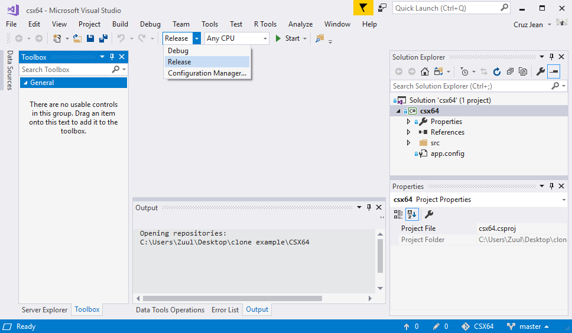
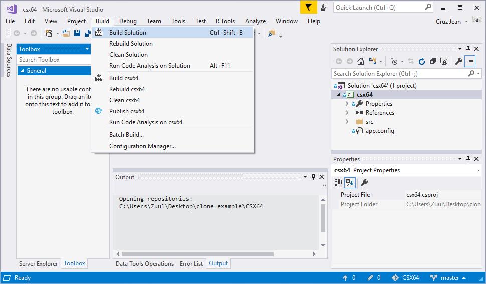
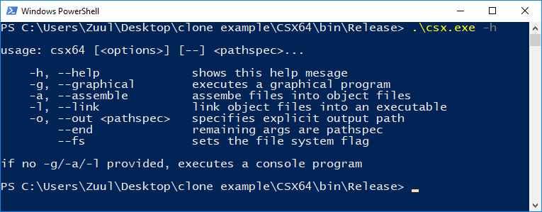

# CSX64
CSX64 is a 64-bit processor emulator *(custom machine code - subset of Intel instruction set)*. It comes with a built-in, thorough assembly language loosely based around NASM.

CSX64 was designed to be an educational tool for learning low-level programming in a well-documented, safe, emulated environment that is **platform independent**.

CSX64 is written entirely in standard C++17 with no external libraries *(aside from my own, which themselves are standard, etc.)*. Because of this, CSX64 can be dropped into any C++ project on any system with very little effort.

This repo features the full CSX64 library (e.g. an assembler and machine code interpreter). [`main.cpp`](main.cpp) serves only to bind these two together into a functional console application. If you want to include CSX64 in another C++ project, you'll probably want to leave `main.cpp` out of your build configuration. All other files are purely CSX64. The interpreter and assembly portions can function independently, but some files are shared (e.g. [`CoreTypes.h`](CoreTypes.h).

There's even a [C# distribution](https://github.com/dragazo/CSX64), if you're into that kind of thing.

## Get Your Own Build
To get your own build, start out with a repo clone including submodules (e.g. via `git clone --recurse-submodules https://github.com/dragazo/CSX64-cpp`). This will create a new folder named CSX64 that looks something like this:


For the rest of the instructions, jump down to whatever operating system you're on.

### Windows
CSX64 is built in [Visual Studio Community 2017](https://www.visualstudio.com/downloads/) *(though most versions should still work)*. Open the `.sln` file (selected in the above image) in VisualStudio. This will bring you to the following window:



Make sure `Release` mode is selected (see above), as well as `x64` (to the right of that) on 64-bit machines for improved performance. Now select `Build > Build Solution`:



You should now have an executable at `release/csx.exe`.

### Linux
Open up a terminal and `cd` to the root CSX64 folder. You should see a file called `makefile`. All you need to do is type the following:

```bash
make
```

If you get a message saying gcc is not installed, follow instructions elsewhere to install it, then retry (the error message will likely tell you exactly the command you need to run to install it).

You should now have an executable called `csx.exe`.

## Last Step

`csx.exe` is a console application, which I'll demonstrate in PowerShell:



Now you need to assemble CSX64's standard library (located in the `asm` directory) and **place the resulting object files in the same directory as the executable** *(and in the same hierarchy)*. To make this easier, a bash script named [`update.sh`](update.sh) is included in CSX64's root directory. Open up your bash terminal *(e.g. git bash)* and enter the following command (where dest is where to place the output):

```
./update.sh <dest>
```

**important:** Make sure you have the following file structure!
* csx.exe
* _start.o
* stdlib
  * etc.o
  * etc.o
  * ...

**Boom, you're done.** CSX64 doesn't need to be installed: all you need is the executable and the object files you just created.

If you plan on using CSX64 from a different directory than the executable, you may want to move it to a safe location (e.g. Documents or Program Files on windows systems) and edit your system environment variables to access it remotely from the console. To do this on windows (10), open up settings and search for `environment`. Select edit system environment variables. This should open the `System Properties` diaglog. Select `Advanced > Environment Variables`. Be very careful in here, but what you're looking for is the `PATH` variable (either the system variable or the account variable). Select this one and hit `Edit`. In the dialog that shows, click `New` and paste in the absolute path to the directory of your executable (not to the executable itself). Hit ok on everything and you should be good to go. From now on, you can use `csx` in the terminal as if it were an installed program. I make a lot of programs that I use regularly in the terminal, so here's a piece of advice: make one folder in a safe location and add it to the `PATH` variable - then when you want to add/remove a personal program you can just add/remove it from that folder rather than having to mess with the environment variables every single time.

## Specification

For more information on CSX64, including information on assembly language and machine code, see the [specification](https://github.com/dragazo/CSX64-stdlib/blob/master/CSX64%20Specification.pdf).
